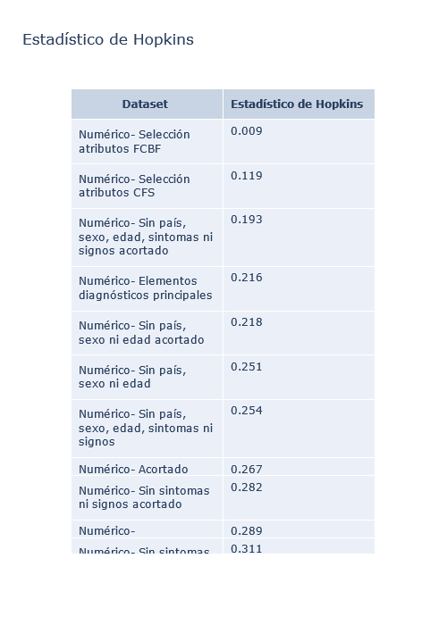
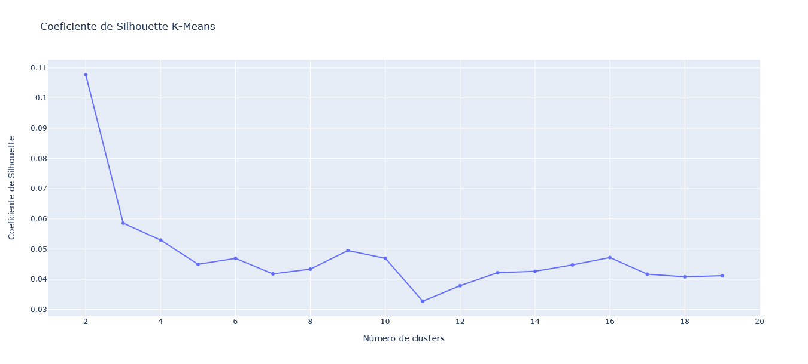
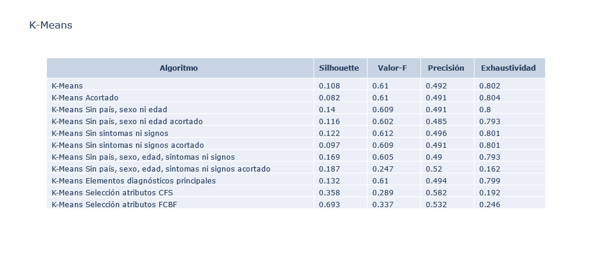
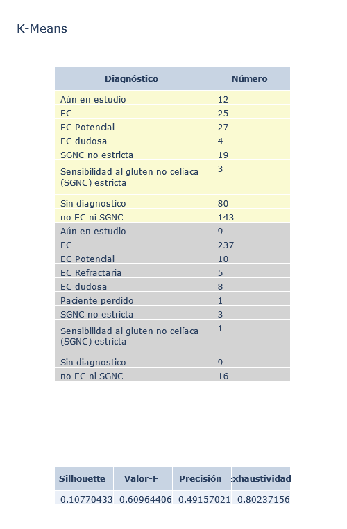
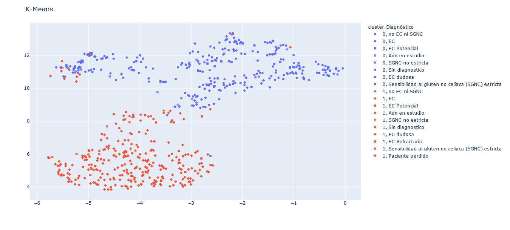

# Algoritmos de clustering para apoyo al diagnóstico de la Enfermedad Celíaca

El objetivo del proyecto es continuar con la línea de investigación ya empezada en el año 2020 entre la Facultad de Informática de la Universidad Complutense de Madrid y el Hospital Clínico San Carlos. Más concretamente, el objetivo es ayudar al diagnóstico de la enfermedad celiaca en pacientes que no cursan una clínica habitual.
Para ello llevamos a cabo el formateo de los datos (los que por motivos de privacidad no se incluyen en el repositorio) y la posterior aplicación de algoritmos de clustering para tratar de encontrar relaciones entre los pacientes de la base de datos. 

<b>INDICE</b>
1. [Cómo ejecutar el proyecto](#installation)
2. [Preprocesado de los datos](#preprocesado)
    
    2.1. [Filtrado y formateo de las columnas](#filtrado)

    2.2. [Tratamiento de datos categóricos](#categoricos)
    
    2.3. [Tratamiento de datos incompletos](#incompletos)
    
    2.4. [Escalado de los datos](#escalado)
3. [Construcción de los datasets](#datasets)
4. [Aplicación de los métodos de clustering](#metodos)
5. [Evaluación de los datasets y de los métodos de clustering](#evaluacion)
6. [Visualización de los resultados](#visualizacion)
7. [Datos simulados](#simulados)
8. [Referencias](#referencias)
9. [Autores](#autores)


## 1. Cómo ejecutar el proyecto
<div id='installation'></div>
En este repositorio se incluye un fichero de datos que por supuesto no es el real, pero que tiene la misma estructura (en cuanto a las columnas que contiene) y que permitirá a aquellas personas que lo deseen ejecutar el proyecto y visualizar los resultados. 

Para ejecutar el código y visualizar los resultados en local tendrás que seguir los siguientes pasos:
1. **Instala Python 2.7 y Python3.** Puedes instalarlos desde los siguientes links [Python 2](https://www.python.org/downloads/release/python-2716/) y [Python 3](https://www.python.org/downloads/release/python-395/).
2. **Instala Anaconda y sigue los pasos de instalación.** Puedes instalar Anaconda desde [aquí](https://www.anaconda.com/products/individual). Después, solo tendrás que seguir los pasos de la instalación y esperar unos minutos a que se complete. 
3. **Instala git bash.** Puedes instalar git bash desde [aquí](https://git-scm.com/downloads). Después, solo tendrás que seguir los pasos de instalación y esperar unos minutos a que se complete.
4. **Descarga el repositorio del proyecto en local:** Abre la consola de git bash y navega hasta el directorio donde deseas descargar el proyecto luego solo tendrás que ejecutar 
    ```
       git clone https://github.com/TFG-Informatica-Enfermedad-Celiaca/Analisis-EC.git
    ```
5. **Descarga el repositorio de la librería scikit-feature:** Desde la consola de git bash navega hasta el directorio donde has descargado el repositorio anterior y descarga este repositorio para ello tienes que ejecutar:
    ```
       git clone https://github.com/jundongl/scikit-feature
    ```
6. **Cambios en el repositorio scikit-feature:** Las funciones que utilizaremos tienen algunas erratas que debemos arreglar para el correcto funcionamiento del proyecto. Para ello en el explorador de archivos iremos al directorio donde hayamos descargado el repositorio de scikit-feature, navegaremos a *skfeature/function/information_theoretical_based/FCBF.py* y abrimos el fichero con un editor de texto para cambiar la línea 39 sustituyendo el valor actual t1=np.zeros((n\_features, 2), dtypes='object')} por t1=np.zeros((n\_features, 2), dtype='object') y en la  línea 53 sustituimos fp= X[:, s_list[idx, 0]]} por fp=$X[:, int(s_list[idx, 0])].
    
7. **Instalar las librerías necesarias:** Para ello abre Spyder y ejecuta en la consola de Spyder los siguientes comandos.
    ```
        conda install numpy
        conda install pandas
        conda install -c plotly plotly
        conda install -c conda-forge scikit-learn 
        conda install -c conda-forge scikit-learn-extra
        pip install kPOD
        pip install kmodes
        conda install -c conda-forge umap-learn
        conda install matplotlib
        pip install pyclustertend
        conda install -c anaconda scipy
    ```
    Si la ejecución de alguno de estos comandos te da error, prueba ejecutándolo con el flag --user.
            
8. **Instalar el repositorio scikit-feature:** Abre la consola de tu sistema operativo y navega hasta el directorio donde hayas descargado el repositorio de scikit-feature. 
        8.1 Si eres usuario de Windows ejecuta: 
        ```
             setup.py install
        ```
        8.2 Si eres usuario de Linux ejecuta: 
            ```
               python setup.py install
            ```
            
9. **Ejecuta fichero source.py** Abre en Spyder el fichero source.py y ejecútalo. La ejecución tardará unos minutos, cuando termine encontrarás los resultados en la carpeta */images*.

## 2. Preprocesado de los datos
<div id='preprocesado'></div>

Este proceso fue complejo y constó de distintas etapas. 

### 2.1. Filtrado y formateo de las columnas
<div id='filtrado'></div>

En primer lugar se seleccionaron las columnas importantes que fueron elegidas tras una reunión con la Médica. Estas columnas se pueden ver en el fichero Important Columns.xlsx.
Después dada la elevada complejidad de los datos tuvimos que hacer un tratamiento especial para cada una de las columnas relevantes, la implementación se puede ver [aquí](preprocessing/format_data.py).

### 2.2. Tratamiento de datos categóricos
<div id='categoricos'></div>

La mayoría de los métodos de clustering (excepto KPrototypes y KModes) trabajan únicamente con datos numéricos, sin embargo nuestro dataset contiene muchos datos categóricos, para transformarlos utilizamos la función [get_dummies](https://pandas.pydata.org/pandas-docs/stable/reference/api/pandas.get_dummies.html). La implementación se puede ver [aquí](preprocessing/categorical_data.py).

### 2.3. Tratamiento de datos incompletos
<div id='incompletos'></div>

El mayor problema de los datos de los que disponemos es la gran cantidad de valores vacíos. Estos valores vacíos aparecen por dos motivos principales: o bien al paciente aún no se le han realizado todas las pruebas pertinentes o bien el paciente proviene de otro hospital y por ello no se dispone de todo su historial.
Además como bien sabemos los algoritmos de clustering, en su mayoría, no admiten datasets incompletos. Por este motivo es necesario confrontar este problema. Históricamente se han seguido dos enfoques principales: 
- La *eliminación de datos* aplicamos tres enfoques, la eliminación de columnas con algún dato incompleto, la eliminación de filas con un dato incompleto, y la eliminación según porcentajes de la columna o fila con un mayor número de elementos incompletos. La implementación se puede ver [aquí](preprocessing/deletion.py), 
pero ninguna de estas técnicas funciona de forma satisfactoria con nuestro dataset porque eliminan demasiados datos.
- La *imputación*:  la imputación univariada se descartó totalmente pues no tiene sentido por el tipo de datos (datos médicos) con los que estamos tratando. Por lo que se utilizaron:
  - Imputación multivariada: Hemos utilizado la implementación de sklearn de este imputador [IterativeImputer](https://scikit-learn.org/stable/modules/generated/sklearn.impute.IterativeImputer.html#sklearn.impute.IterativeImputer) sobre nuestro dataset. 
  Pero tuvimos problemas de convergencia aún utilizando un número muy alto de iteraciones (en concreto 100) por lo que consideramos que este tipo imputación es incompatible con nuestro dataset. Su implementación se puede ver [aquí](preprocessing/imputation.py).
  - Imputación por vecinos más cercanos: Hemos utilizado la implementación disponible en sklearn [KNNImputer](https://scikit-learn.org/stable/modules/generated/sklearn.impute.KNNImputer.html#sklearn.impute.KNNImputer) de forma satisfactoria. Su implementación se puede ver [aquí](preprocessing/imputation.py).
 
### 2.4. Escalado de los datos
<div id='escalado'></div>

Las escalas de los datos numéricos diferían hasta dos órdenes de magnitud, como muchos de los algoritmos de clustering están basados en distancias tener unos datos sin escalar supondría que el método solo tuviera en cuenta las columnas con datos con mayor magnitud.
Aunque existen muchas técnicas la elegida por nosotros fue [QuantileTransformer](https://scikit-learn.org/stable/modules/generated/sklearn.preprocessing.QuantileTransformer.html), el escalado se puede ver [aquí](preprocessing/scale.py).

## 3. Construcción de los datasets
<div id='datasets'></div>

Como ya hemos dicho la gran mayoría de los métodos utilizan datasets numéricos, por este motivo solo describiremos aquí los datasets numéricos que construimos. Pero hay que tener en cuenta que también generamos datasets categóricos (para el método KModes), mixtos (para el método KPrototypes) y con datos incompletos (para el método KPOD) cuya selección de columnas sigue la lógica de los otros. 
- *Dataset completo*: Incluye el dataset completo obtenido tras el preprocesado.
- *Dataset resumido*: Elimina las columnas redundantes para las que se tiene tanto resultados numéricos como categóricos, conservando únicamente los numéricos. Este sería el caso de las pruebas de anticuerpos ATG2, A-PDG o la prueba de LIEs.
- *Dataset sin país, sexo, edad de diagnóstico ni grado de parentesco*: Al dataset completo le eliminamos las columnas relativas al país, sexo, edad de diagnóstico y grado de parentesco con otros enfermos celíacos.
- *Dataset sin país, sexo, edad de diagnóstico ni grado de parentesco resumido*: Al dataset resumido le eliminamos las columnas relativas al país, sexo, edad de diagnóstico y grado de parentesco.
- *Dataset sin signos ni síntomas*: Al dataset completo le eliminamos las columnas relativas a los signos, síntomas y enfermedades autoinmunes.
- *Dataset sin signos ni síntomas resumido*: Al dataset resumido le eliminamos las columnas relativas a los signos, síntomas y enfermedades autoinmunes.
- *Dataset sin país, sexo, edad de diagnóstico, grado de parentesco, síntomas ni signos*: Al dataset completo le eliminamos las columnas relativas al país, sexo, edad de diagnóstico, grado de parentesco, signos, síntomas y enfermedades autoinmunes.
- *Dataset sin país, sexo, edad de diagnóstico, grado de parentesco, síntomas ni signos resumido*: Al dataset resumido le eliminamos las columnas relativas al país, sexo, edad de diagnóstico, grado de parentesco, signos, síntomas y enfermedades autoinmunes.
- *Dataset con criterios diagnósticos*: Tras acudir al VII congreso nacional de la SECC (Sociedad Española de la Enfermedad Celiaca) fuimos capaces de determinar cúales eran los criterios para diagnosticar la enfermedad celíaca. Estos son:
  - **Genética:** por ello en este dataset incluimos la columna *HLA: grupos de riesgo*, y el parentesco de primer grado.
  - **Serología en dieta con gluten:** por ello incluimos los resultados de las pruebas EMA,  ATG2,  A-PDG , LIEs.
  - **Sospecha clínica (síntomas y signos compatibles con la enfermedad celíaca):** aunque todos los síntomas y signos que aparecen recogidos en nuestra base de datos son compatibles con la enfermedad celíaca solo incluimos los más comunes Diarrea crónica, Estreñimiento, Distensión abdominal, Dispepsia, Malabsorción, Anemia ferropénica o ferropenia. 
  - **Biopsia en dieta con gluten**
  - **Información relevante en dieta sin gluten**: Resultados de la biopsia una vez el paciente está siguiendo una dieta sin gluten y resultados de los LIEs.
- *Dataset con selección de columnas relevantes mediante CFS*: Este dataset solo contiene las columnas consideradas relevantes por CFS (estas fueron seleccionadas utilizando solo la parte del Dataset con diagnóstico válido, es decir, no vacío). Las columnas elegidas por CFS fueron *LIEs DCG %iNK, Biopsia DCG_M0, Valoracion LIEs DCG_No compatible con EC, DCG_ATG2_VALUE,DCG EMA_Positivo, DCG_ATG2_Negativo, LIEs DCG %GD, Valoracion LIEs DCG_Compatible con EC activa, DSG ATG2_Negativo, DCG A-PDG_Negativo, Biopsia DCG_M3b, LIEs DSG %GD*.
- *Dataset con selección de columnas relevantes mediante FCBF*: Este dataset solo contiene las columnas consideradas relevantes po FCBF (estas fueron seleccionadas utilizando solo la parte del dataset con diagnóstico no vacío). Las columnas elegidas fueron *LIEs DCG %iNK, Biopsia DCG_M0, Valoracion LIEs DCG_No compatible con EC, DCG EMA_Positivo, Biopsia DSG_M3b, Esclerosis múltiple*.

La generación de todos los datasets se puede ver [aquí](preprocessing/preprocess.py)
## 4. Aplicación de los métodos de clustering
<div id='metodos'></div>

Sobre todos los datasets listados en el apartado anterior ejecutamos los algoritmos de clustering más conocidos: [KMeans](clustering/kmeans.py),  [KMedoids](clustering/kmedoids.py), [Clustering aglomerativo](clustering/agglomerative.py), [Clustering espectral](clustering/spectral.py), [DBSCAN](clustering/DBSCAN.py), [Optics](clustering/optics.py).

Además utilizamos otros algoritmos de clustering menos conocidos pero que por el tipo de datos (gran cantidad de datos categóricos, y datos incompletos) resultaban de mucho interés como son: [KPrototypes](clustering/kmodes_prototypes.py), [KModes](clustering/kmodes_prototypes.py), [kPOD](clustering/kpod_a.py).

## 5. Evaluación de los datasets y de los métodos de clustering
<div id='evaluacion'></div>

Para la evaluación de los datasets utilizamos el [estadístico de Hopkins](clustering/hopkins_statistics.py). 
Para la evaluación de los métodos de clustering utilizamos como método intrínseco el [coeficiente de Silhouette](clustering/silhouette.py) y como método extrínseco [la precisión y exhaustividad BCubed](clustering/b3.py).

## 6. Visualización de los resultados
<div id='visualizacion'></div>

Para la visualización de los resultados estamos utilizando la librería Plotly. Cuando se ejecuta nuestro programa se generar los siguientes elementos básicos de visualización:
1. Comparación de la calidad de los datasets mediante estadístico de Hopkins.

<p align="center">
  
</p>

2. Gráfica del coeficiente de Silhouette para cada algoritmo y dataset concreto.

<p align="center">
  

3. Comparación de los datasets para cada método mediante coeficiente de Silhouette y precisión y exhaustividad BCubed.

<p align="center">
  
</p>

4. Clasificación de los pacientes en clústeres según su diagnóstico, para un método y un dataset concreto. 

<p align="center">
  
</p>

5. Visualización de los pacientes y resultado del clustering en 2D.

<p align="center">
  
</p>

## 7. Datos simulados
<div id='simulados'></div>

Como ya hemos dicho por motivos de protección de datos no podemos incluir en el repositorio los datos reales con los que trabajamos pero se ha generado un archivo de datos simulados para que se pueda ejecutar en local el proyecto el fichero es Fichero prueba.xlsx.

## 8. Referencias
<div id='referencias'></div>

Chi JT, Chi EC, Baraniuk RG (2016). “k-POD: A Method for k-Means Clustering of Missing Data.” The American Statistician, 70, 91–99. doi: 10.1080/00031305.2015.1086685, http://www.tandfonline.com/doi/abs/10.1080/00031305.2015.1086685.

Radia, Ishaan (2020). “A Python implementation of k-POD.” https://github.com/iiradia/kPOD/.

Nelis J. de Vos (2015-2021). "kmodes categorical clustering library" https://github.com/nicodv/kmodes

Li, Jundong and Cheng, Kewei and Wang, Suhang and Morstatter, Fred and Trevino, Robert P and Tang, Jiliang and Liu, Huan (2018). "Feature selection: A data perspective"
ACM Computing Surveys (CSUR). https://arxiv.org/pdf/1601.07996.pdf

Matthew Wiesner. "A Python implementation of BCubed" https://github.com/m-wiesner/BCUBED

Ismaël Lachheb (2019) "pyclustertend" https://github.com/lachhebo/pyclustertend
## 9. Autores
<div id='autores'></div>

**Carla Martínez Nieto-Márquez**- [LinkedIn](https://www.linkedin.com/in/carla-mart%C3%ADnez-nieto-m%C3%A1rquez-a59435176/)- [Github](https://github.com/carlita98)

**Pablo Sanz Caperote** -[Github](https://github.com/SCPablo)

